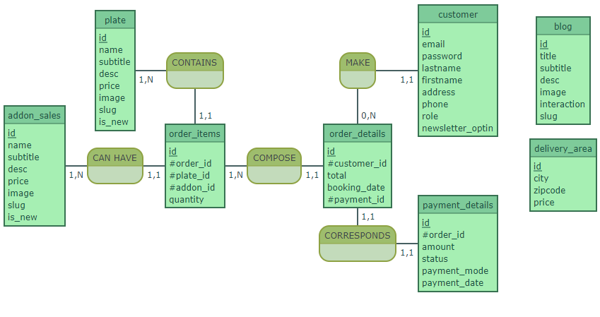

## MCD

`user: id, email, password, lastname, firstname, address, phone, role

MAKE, 11 user, 0N order_details

order_details: id, #user_id, total, booking_date, #payment_id

COMPOSE, 1N order_items, 11 order_details

order_items: id, #order_id, #product_id, quantity

CORRESPONDS, 11 payment_details, 11 order_details

payment_details: id, #order_id, amount, status, payment_mode

CONTAINS, 1N product, 11 order_items

product: id, name, subname, desc, price, image, is_new`

---

Diagram relationship

**addon_sales** (<ins>id</ins>, name, subtitle, desc, price, image, slug, is*new) 
**blog** (<ins>id</ins>, title, subtitle, desc, image, interaction, slug) 
**customer** (<ins>id</ins>, email, password, lastname, firstname, address, phone, role, newsletter_optin, *#id.1*) 
**delivery_area** (<ins>id</ins>, city, zipcode, price) 
**order_details** (<ins>id</ins>, #customer_id, total, booking_date, #payment_id, *#id.1*) 
**order_items** (<ins>id</ins>, #order_id, #plate_id, #addon_id, quantity, *#id.1*, *#id.2*) 
**payment_details** (<ins>id</ins>, #order_id, amount, status, payment_mode, payment_date, *#id.1\_) 
**plate** (<ins>id</ins>, name, subtitle, desc, price, image, slug, is_new)

---

